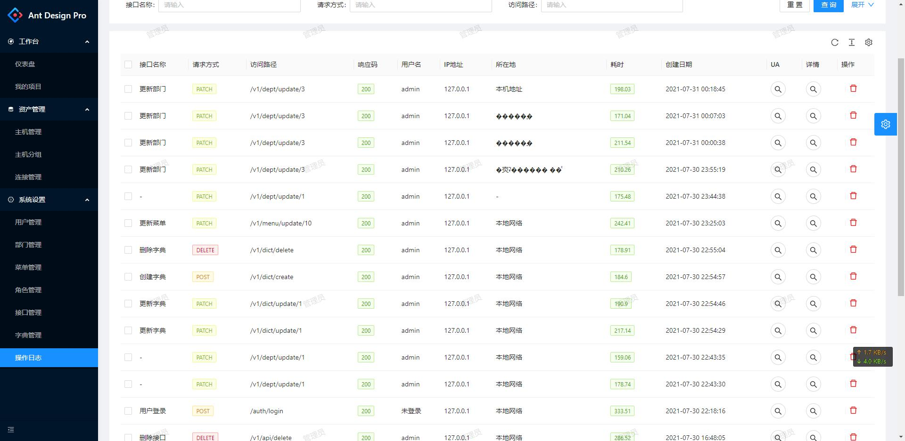
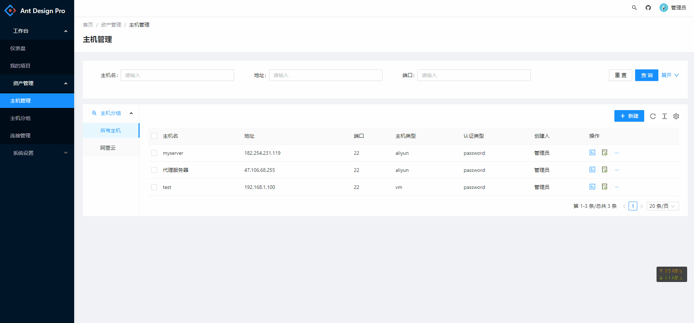

# anew-server

#### 介绍
golang  运维平台

登陆用户名
用户名:admin

密码: 123456

重构前端：ant pro design V5 typescript 按钮级权限管理

前端地址 https://github.com/xufqing/anew-server/frontend
#### 软件架构
软件架构说明

1. RBAC 权限管理

2. 便捷的终端管理器

3. 终端操作录像

gin/gormV2/go-redis/jwt/casbin/zap/ssh/websocket...

#### 待办事项
- [ ] 主机信息
- [ ] 批量执行  
- [ ] 项目管理
- [ ] 对接Jenkins
- [ ] 日志查看工具
- [ ] mysql客户端
- [ ] 工作流

#### 截图

